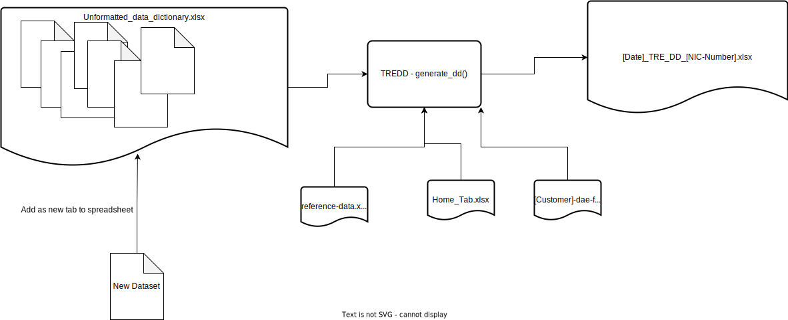

# Trusted Research Environment Data Dictionary (TREDD)

This package contains a collection of functions that can be used to generate a coherent, visually appealing (sort of 🤔) data dictionary which details the datasets available in a NHS England's secure data environment (SDE), formerly the Trusted Research Environment (TRE).

The package has one main function `generate_dd()` which returns a formatted data dictionary in the form of an excel workbook, where each sheet will correspond to a specific dataset. The function will also generate a home tab, which contains a drop-down list of all the datasets available in the workbook and a reference data
tab.

## Proof of Concept - Moving Data Dictionary in the SDE

The unpack_functions folder contains code used as part of the proof of concept project to move the data dictionaries into the Secure Data Environment (SDE).

## Overview of Current Process

The general overview of the entire process is as follows:

<br/>



<br/>

### Adding drop-down hyperlinks

Once the data dictionary has been generated, the following steps need to be completed to ensure the home tab drop-down hyperlinks work as intended:

1.  Check to see if a sheet reference named `select_sheet` was successfully created in the output file by selecting `Formulas > Name Manager`:


<br/>

2.  Ensuring that your cursor is on the the drop-down list cell, insert a hyperlink by selecting `Insert > Link > This Document > Defined Names > 'select_sheet'`. Once set, test if this drop-down hyperlink points to an empty cell when clicked:


<br/>

3.  Select `Formulas > Name Manager > and "select_sheet"` and enter the following into the `'Refers To'` box and then close the dialogue box (save the changes when prompted):

    ```
    =INDIRECT(ADDRESS(3,1,,,INDIRECT("select_dataset")))
    ```

    

<br/>

4.  Reformat the hyperlink, drop down cell using the following properties, to ensure consistency will the rest of the file:

    `face = bold`; `size = 20`; `colour = black`; `family = Arial`


<br/>
